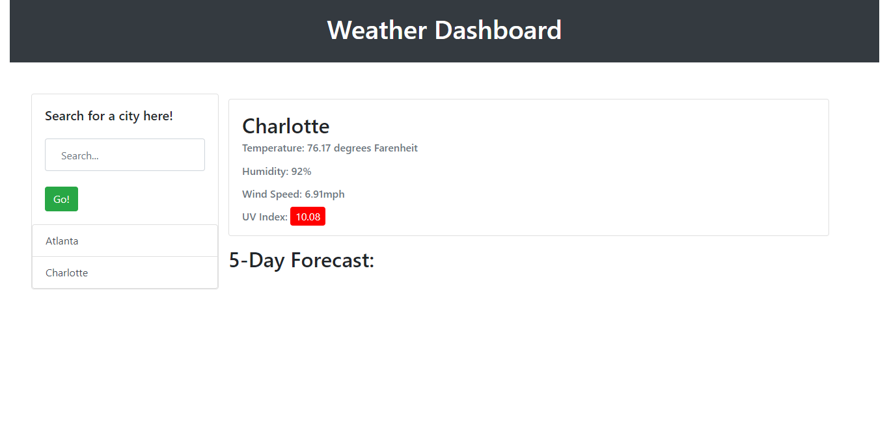

# Weather Tracker

## Table of Contents
- [Desctiption](#description)
- [Visuals](#visuals)
- [Technologies Used](#technologies-used)
- [Resources](#resources)

## Description
An application that utilizes the third-party API, OpenWeather, to retrieve weather data for cities and displays the weather (temperature, humidity, wind speed, and uv index).
## Visuals

## Technologies Used
- Open Weather API

## Resources
- [Live Site](https://codytheroux96.github.io/weather-tracker/)
- [Repo](https://github.com/codytheroux96/weather-tracker)